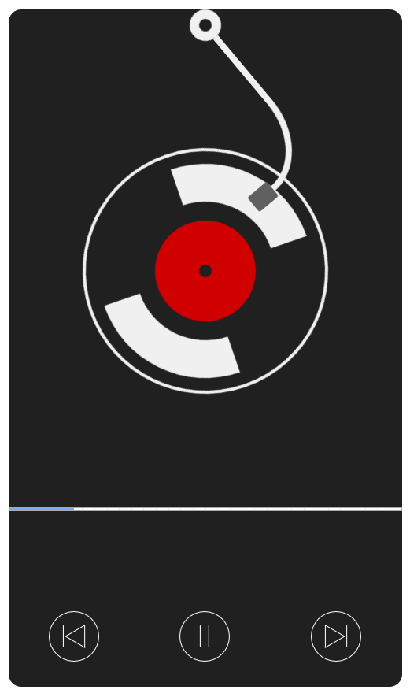

# visualizer-html5-music-player

a simple visualizer html5 music player

this project use the followoing techniques:

 - fetch() API
 - css transform
 - css animation
 - web audio api
 - flexbox layout
 - javascript event delegate
 - html5 progress element

## front face

the front face of the player:

## back face

the back face of the player:

;
